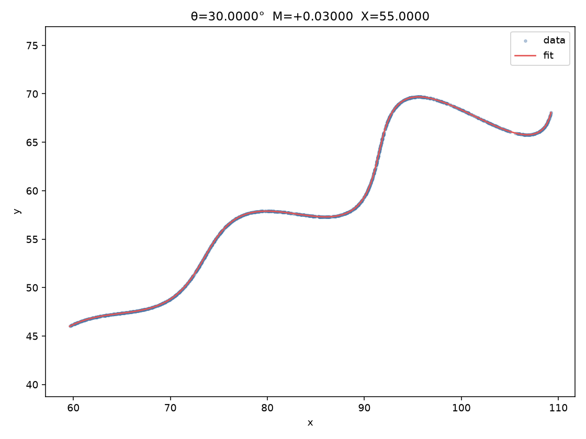

# Parametric curve parameter recovery

Recover the three unknown parameters of a planar parametric curve from
`data/xy_data_3.csv` (1500 samples).

**Answer**

| param | value |
|---|---|
| θ | 30° = π/6 ≈ 0.523598775598 rad |
| M | 0.03 |
| X | 55 |

Desmos: https://www.desmos.com/calculator/w1frkudmfq

```
\left(t\cos(\frac{\pi}{6})-e^{0.03\left|t\right|}\sin(0.3t)\sin(\frac{\pi}{6})+55,42+t\sin(\frac{\pi}{6})+e^{0.03\left|t\right|}\sin(0.3t)\cos(\frac{\pi}{6})\right)
```

Domain: `6 ≤ t ≤ 60`

Mean L1 from each data point to this model: **2.06e-5** (floating-point noise; the CSV is a clean sample of this curve).



## Model

The brief gives

```
x(t) = t cos(θ) − exp(M |t|) sin(0.3 t) sin(θ) + X
y(t) = 42 + t sin(θ) + exp(M |t|) sin(0.3 t) cos(θ)
```

with bounds 0° < θ < 50°, −0.05 < M < 0.05, 0 < X < 100, and 6 < t < 60.
θ inside `cos`/`sin` is radians. Only θ, M, X are unknowns; t is a dummy
parameter along the curve, not part of the submitted answer.

The same equations rewrite as a straight backbone plus a sideways weave:

```
u    = (cos θ, sin θ)          heading of the line
n    = (−sin θ, cos θ)         90° left of heading
o    = (X, 42)                 origin (42 is given, X is unknown)
p(t) = o + t u + exp(M |t|) sin(0.3 t) n
```

`t` is distance along the line. `X` slides the whole curve left/right.
`M` grows or damps the weave. The sine term is the weave itself.

## Approach

This is not three equations in three unknowns. There are 1500 points and
three globals, so the job is an overdetermined fit: a bound-constrained
nonlinear program. Search z = (θ, M, X) inside the given box to minimise
the mean L1 distance from the data to the curve that z generates.

t is not a submitted unknown. For a candidate z it is still needed per
point in order to score that z. Because the weave `n` is orthogonal to
the heading `u`,

```
t_i = clip( (p_i − o) · u , 6, 60 )
```

is closed form. The residual of point i is `|p_i − p(t_i)|_1`, and the
objective is the mean over i. That evaluation is O(n) and is what every
solver sees.

Several independent searches run on the same objective so a local minimum
is not reported as the answer:

1. Geometric seed — SVD/PCA direction of the cloud for θ, median intercept
   for X, M = 0 (ignore the weave at init). L1 ≈ 1.80.
2. Coarse grid around that seed. L1 ≈ 0.34.
3. Differential evolution (`scipy.optimize.differential_evolution`).
4. Dual annealing.
5. Basin hopping.
6. Nelder–Mead and L-BFGS-B polish from each of those starts.

DE / annealing / BFGS are SciPy. This repo implements the curve, the L1
objective, the seed, and the grid.

Every global method collapsed to the same point: **θ = 30°, M = 0.03, X = 55**.
Nelder–Mead L1 ≈ 3.5e-6; rounding to those three exact values gives 2e-5.
That is the generating curve, not a lucky basin.

## Code (`fit.py`)

| function | role |
|---|---|
| `curve` | evaluate x(t), y(t) for a candidate (θ, M, X) |
| `mean_l1_project` | O(n) objective used inside the solvers (closed-form t) |
| `mean_l1` | chamfer L1 to a uniform t-grid; used as a check, not inside DE |
| `geometric_seed` | PCA heading + median X, M = 0 |
| `run_solvers` | seed → grid → DE → annealing → hopping → Nelder-Mead / L-BFGS-B |
| `desmos_string` | submission paste |
| `save_plot` | overlay of data vs fitted curve (`results/fit.png`) |

`run_solvers` records every method’s (θ, M, X, L1) into `results/fit.json`
and keeps the lowest L1. `main` re-scores the winner on a dense t-grid
(p95 / max residual) and writes the Desmos string.

Bounds passed to SciPy sit a hair inside the open intervals from the brief
so the iterates stay valid.

## Results

| method | θ (deg) | M | X | mean L1 |
|---|---|---|---|---|
| geometric seed | 28.48 | 0 | 54.23 | 1.80 |
| coarse grid | 30.48 | 0.030 | 55.48 | 0.34 |
| differential evolution | 30.00 | 0.030 | 55.00 | 3.5e-6 |
| dual annealing | 30.00 | 0.030 | 55.00 | 3.5e-6 |
| basin hopping | 30.00 | 0.030 | 55.00 | 1.2e-5 |
| Nelder–Mead polish | 30.00 | 0.030 | 55.00 | 3.5e-6 |
| L-BFGS-B polish | 30.00 | 0.030 | 55.00 | 3.5e-6 |
| **reported (exact)** | **30** | **0.03** | **55** | **2.06e-5** |

The last row is θ = π/6, M = 0.03, X = 55. The 2e-5 vs 3e-6 gap is rounding;
both are noise relative to the scale of the data (x ~ 60–109, y ~ 46–70).

## Run

```
python -m venv .venv
source .venv/bin/activate
pip install -r requirements.txt
python fit.py
```

## Layout

```
data/xy_data_3.csv   1500 samples
fit.py               model, objective, solvers, plot
results/fit.json     every method’s (θ, M, X, L1)
results/fit.png      overlay
results/answer.json  reported triple
```
